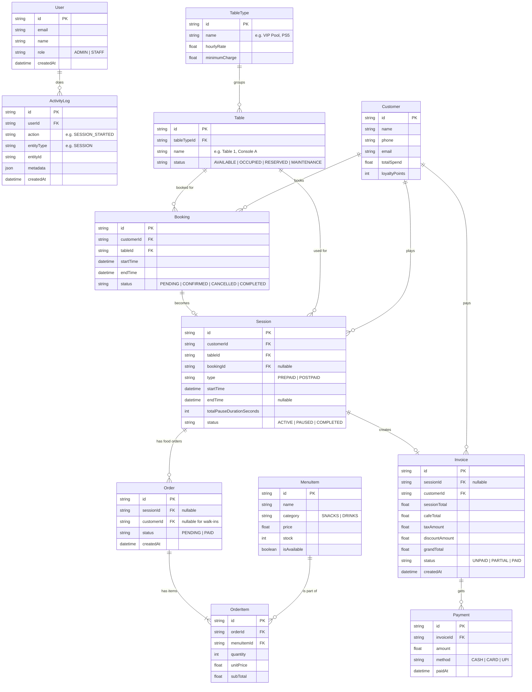

# Database ER Diagram

Here is a simple diagram to show how our database tables are connected to each other.

```mermaid
erDiagram
    User ||--o{ ActivityLog : "does"
    User {
        string id PK
        string email
        string name
        string role "ADMIN | STAFF"
        datetime createdAt
    }

    Customer ||--o{ Booking : "books"
    Customer ||--o{ Session : "plays"
    Customer ||--o{ Invoice : "pays"
    Customer {
        string id PK
        string name
        string phone
        string email
        float totalSpend
        int loyaltyPoints
    }

    TableType ||--o{ Table : "groups"
    TableType {
        string id PK
        string name "e.g. VIP Pool, PS5"
        float hourlyRate
        float minimumCharge
    }

    Table ||--o{ Booking : "booked for"
    Table ||--o{ Session : "used for"
    Table {
        string id PK
        string tableTypeId FK
        string name "e.g. Table 1, Console A"
        string status "AVAILABLE | OCCUPIED | RESERVED | MAINTENANCE"
    }

    Booking ||--o| Session : "becomes"
    Booking {
        string id PK
        string customerId FK
        string tableId FK
        datetime startTime
        datetime endTime
        string status "PENDING | CONFIRMED | CANCELLED | COMPLETED"
    }

    Session ||--o{ Order : "has food orders"
    Session ||--o| Invoice : "creates"
    Session {
        string id PK
        string customerId FK
        string tableId FK
        string bookingId FK "nullable"
        string type "PREPAID | POSTPAID"
        datetime startTime
        datetime endTime "nullable"
        int totalPauseDurationSeconds
        string status "ACTIVE | PAUSED | COMPLETED"
    }

    MenuItem ||--o{ OrderItem : "is part of"
    MenuItem {
        string id PK
        string name
        string category "SNACKS | DRINKS"
        float price
        int stock
        boolean isAvailable
    }

    Order ||--|{ OrderItem : "has items"
    Order {
        string id PK
        string sessionId FK "nullable"
        string customerId FK "nullable for walk-ins"
        string status "PENDING | PAID"
        datetime createdAt
    }

    OrderItem {
        string id PK
        string orderId FK
        string menuItemId FK
        int quantity
        float unitPrice
        float subTotal
    }

    Invoice ||--o{ Payment : "gets"
    Invoice {
        string id PK
        string sessionId FK "nullable"
        string customerId FK
        float sessionTotal
        float cafeTotal
        float taxAmount
        float discountAmount
        float grandTotal
        string status "UNPAID | PARTIAL | PAID"
        datetime createdAt
    }

    Payment {
        string id PK
        string invoiceId FK
        float amount
        string method "CASH | CARD | UPI"
        datetime paidAt
    }

    ActivityLog {
        string id PK
        string userId FK
        string action "e.g. SESSION_STARTED"
        string entityType "e.g. SESSION"
        string entityId
        json metadata
        datetime createdAt
    }
```
